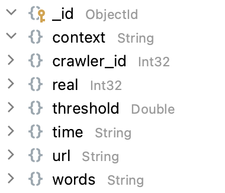

# Context Analyze

## Prerequisites

+ Python >= 3.9
+ MongoDB server
+ Download `BERT-Base, Uncased: 12-layer, 768-hidden, 12-heads, 110M parameters` from [google-research](https://github.com/google-research)/**[bert](https://github.com/google-research/bert)**
+ Fill `appid` and `appkey` of Baidu Translation API in `context_analyze.py`


## Database

+ Table structure of input collection<br>
  
+ Fill connection parameters in `config.py`


## Commands

### Install dependencies

```
pip install bert-serving-client
pip install bert-serving-server
pip install scipy
pip install pymongo
```

### Run the code

```
bert-serving-start -model_dir=./uncased_L-12_H-768_A-12/ -num_worker=4 -max_seq_len=512 -port=5777 -port_out=5778
# start a new terminal
python context_analyze.py
```

