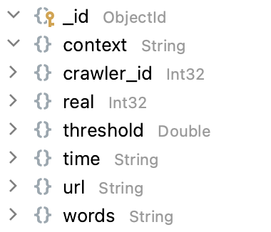

# Context Collect

## Prerequisites

+ Node.js >= v8.0.0 with npm >= v5.0.0
+ MongoDB server
+ npm packages listed in `package.json`


## Database

+ Table structure of output collection<br>
  
+ Fill connection parameters in `config.js`


## Commands

### Install dependencies

```
npm install
```

### Run the code

```
node context_collect.js
```

